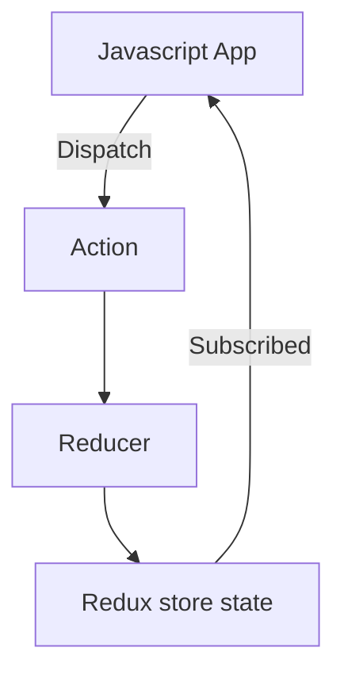

# redux



## preparing project

- create store folder , index.js

`store\index.js`

```javascript
import { createStore } from "redux";
const initialState = { counter: 0, showCounter: true };
const counterReducer = (state = initialState, action) => {
  if (action.type === "increment") {
    return {
      ...state,
      counter: state.counter + 1,
    };
  }
  if (action.type === "increse") {
    return {
      counter: state.counter + action.amount,
    };
  }
  if (action.type === "decrement") {
    return {
      counter: state.counter - 1,
    };
  }
  if (action.type === "decrese") {
    return {
      counter: state.counter - action.amount,
    };
  }
  return state;
};

const store = createStore(counterReducer);
export default store;
```

`App\index.js`

```javascript
import store form './store/index';
import { Provider } from "react-redux";
const root=ReactDom.createRoot(document.getElementById('root')
root.render(<Provider store={store}><App/></Provider>)
```

`components`

```javascript
import { useSelector,useDispatch } from "react-redux";
const Counter = () => {
    const inputRef= useRef()
  const counter = useSelector((state) => state.counter);
  const dispatch = useDispatch();
  function increment(){
    dispatch({type : 'increment'})
  }
    function decrement(){
    dispatch({type : 'decrement'})
  }
   function decrese(){
    dispatch({type : 'decrese',amount:inputRef.current.value})
  }
    function increse(){
    dispatch({type : 'increse',amount:inputRef.current.value})
  }
  return (
    <>
        <input ref={inputRef} value=0> </input>
        <button onClick={increment}>increment</button>
        <button onClick={decrement}>decrement</button>
    </>
  )
};
```

### never mutate state

```javascript
// dont do it
const counterReducer = (state, action) => {
  if (action.type === "increment") {
    state.counter++; // dont do this
    return state;
  }
};
```

## redux-toolkit

```sh
npm install @redux.js/toolkit
```

```javascript
import { createStore,configureStore } from "redux";
import {createSlice} from "@reduxjs/toolkit";
const initialState = { counter: 0, showCounter: true };
const counterSlice=createSlice({
    name:'counter',
    initalState:initialState,
    reducers : {
        increment(state){ state.counter++;},  // you can use here
        decrement(state){state.counter--},
        increse(state, action){ state.counter = state.counter+action.payload},
        decrese(state,action){ state.counter = state.counter+action.payload}
        toggle(state) {
            state.showCounter=!state.showCounter
        }
    }

});


//const store = createStore(counterSlice.reducer);
const store = configureStore({
    reducer:counterSlice.reducer

})
export const counterActions= counterSlice.actions;
export default store;
```

`components`

```javascript
import {counterActions} form '../store/index';
import { useSelector,useDispatch } from "react-redux";


const Counter = () => {
    const inputRef= useRef()
  const counter = useSelector((state) => state.counter);
  const dispatch = useDispatch();
  function increment(){
    dispatch(counterActions.increment())
  }
    function decrement(){
    dispatch(counterActions.decrement())
  }
   function decrese(){
    dispatch(counterActions.decrese(10)) // automatically creates payload
  }
    function increse(){
    dispatch({type : 'increse',amount:inputRef.current.value})
  }
  return (
    <>
        <input ref={inputRef} value=0> </input>
        <button onClick={increment}>increment</button>
        <button onClick={decrement}>decrement</button>
    </>
  )
};
```

## multiple slices

```javascript
import { createStore,configureStore } from "redux";
import {createSlice} from "@reduxjs/toolkit";
const initialCounterState = { counter: 0, showCounter: true };
const counterSlice=createSlice({
    name:'counter',
    initalState:initialCounterState,
    reducers : {
        increment(state){ state.counter++;},  // you can use here
        decrement(state){state.counter--},
        increse(state, action){ state.counter = state.counter+action.payload},
        decrese(state,action){ state.counter = state.counter+action.payload}
        toggle(state) {
            state.showCounter=!state.showCounter
        }
    }

});

const initialAuthState={
    isAuthenticated :false

}
const authSlice  = createSlice({
    name: 'auth',
    initialState:initialAuthState,
    reducers : {
        login(state) {
            state.isAuthenticated=true
        },
        logout(state) {
            state.isAuthenticated = false
        }
    }
})


//const store = createStore(counterSlice.reducer);
const store = configureStore({
    reducer:{
        counter: counterSlice.reducer,
        auth: authSlice.reducer
    }
})
export const counterActions= counterSlice.actions;
export const authActions = authSlice.actions;
export default store;
```

`components`

```javascript
import {counterActions} form '../store/index';
import { useSelector,useDispatch } from "react-redux";


const Counter = () => {
    const inputRef= useRef()
  const counter = useSelector((state) => state.counter.counter);
  const auth= useSelector((state) => state.auth)
  const dispatch = useDispatch();
  function increment(){
    dispatch(counterActions.increment())
  }
    function decrement(){
    dispatch(counterActions.decrement())
  }
   function decrese(){
    dispatch(counterActions.decrese(10)) // automatically creates payload
  }
    function increse(){
    dispatch({type : 'increse',amount:inputRef.current.value})
  }
  return (
    <>
        <input ref={inputRef} value=0> </input>
        <button onClick={increment}>increment</button>
        <button onClick={decrement}>decrement</button>
    </>
  )
};
```
