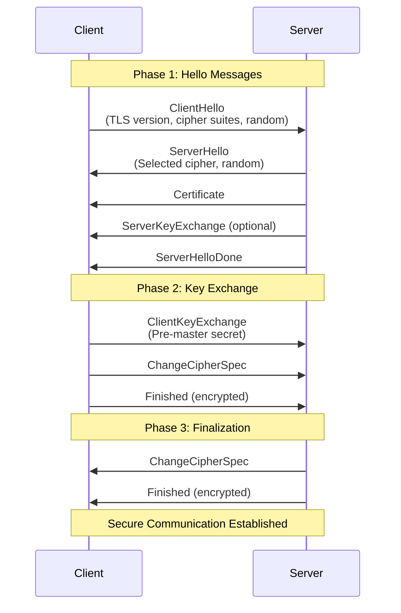

# SSL/TLS - Complete Guide for Interview Preparation

## Table of Contents
1. [Overview](#overview)
2. [SSL vs TLS - Core Differences](#ssl-vs-tls---core-differences)
3. [How SSL/TLS Works](#how-ssltls-works)
4. [Handshake Process](#handshake-process)
5. [Certificates](#certificates)
6. [Architecture Diagrams](#architecture-diagrams)
7. [Interview Preparation](#interview-preparation)
8. [Common Interview Questions](#common-interview-questions)
9. [Real-World Scenarios](#real-world-scenarios)

---

## Overview

**SSL (Secure Sockets Layer)** and **TLS (Transport Layer Security)** are cryptographic protocols designed to provide secure communication over a computer network.

### Key Points 🎯
- **SSL** is deprecated (last version SSL 3.0 in 1996)
- **TLS** is the modern successor (currently TLS 1.2 and 1.3 are in use)
- Both terms are often used interchangeably, but technically we use TLS today
- Primary purpose: **Encryption**, **Authentication**, and **Data Integrity**

### Timeline
```
1995 ─── SSL 2.0 (Netscape)
1996 ─── SSL 3.0
1999 ─── TLS 1.0 (RFC 2246)
2006 ─── TLS 1.1 (RFC 4346)
2008 ─── TLS 1.2 (RFC 5246)
2018 ─── TLS 1.3 (RFC 8446)
2021 ─── TLS 1.0 and 1.1 deprecated
```

---

## SSL vs TLS - Core Differences

### Comparison Table

| Feature | SSL | TLS |
|---------|-----|-----|
| **Full Name** | Secure Sockets Layer | Transport Layer Security |
| **Version History** | SSL 1.0, 2.0, 3.0 | TLS 1.0, 1.1, 1.2, 1.3 |
| **Current Status** | All versions deprecated | TLS 1.2 & 1.3 active |
| **Handshake** | Explicit, slower (more steps) | Implicit, faster (fewer steps) |
| **Alert Messages** | 2 types (warning, fatal) - unencrypted | 3 types (warning, fatal, close_notify) - encrypted |
| **Message Authentication** | MAC (MD5 algorithm) | HMAC (Hash-based MAC) |
| **Cipher Suites** | Older, vulnerable algorithms | Modern, secure algorithms |
| **Record Protocol** | Less secure | Enhanced security |
| **Performance** | Slower | Faster (especially TLS 1.3) |

### Key Improvements in TLS

1. **Security**
   - Stronger encryption algorithms
   - HMAC instead of MAC
   - Encrypted alert messages
   - Removed vulnerable cipher suites

2. **Performance**
   - Reduced handshake round trips (TLS 1.3: 1-RTT, 0-RTT)
   - Streamlined cipher suite negotiation
   - Simplified state machine

3. **Privacy**
   - Encrypted Server Name Indication (ESNI) in TLS 1.3
   - Better forward secrecy

---

## How SSL/TLS Works

### Three Main Goals

```
┌─────────────────────────────────────────────────────────┐
│                   SSL/TLS Objectives                     │
├─────────────────────────────────────────────────────────┤
│                                                          │
│  1. ENCRYPTION          → Confidentiality                │
│     └─ Data cannot be read by third parties             │
│                                                          │
│  2. AUTHENTICATION      → Identity Verification          │
│     └─ Verify you're talking to the right server        │
│                                                          │
│  3. INTEGRITY           → Data Tampering Prevention      │
│     └─ Ensure data hasn't been modified in transit      │
│                                                          │
└─────────────────────────────────────────────────────────┘
```

### The Process Flow

```
Client                                Server
  │                                     │
  │──── 1. ClientHello ────────────────>│
  │     (Supported cipher suites,       │
  │      TLS version, random data)      │
  │                                     │
  │<─── 2. ServerHello ─────────────────│
  │     (Selected cipher suite,         │
  │      certificate, random data)      │
  │                                     │
  │──── 3. Key Exchange ───────────────>│
  │     (Client validates cert,         │
  │      generates pre-master secret)   │
  │                                     │
  │<─── 4. Finished ────────────────────│
  │     (Server confirms)               │
  │                                     │
  │──── 5. Finished ───────────────────>│
  │     (Client confirms)               │
  │                                     │
  │<══════ Encrypted Communication ════>│
```

---

## Handshake Process

### TLS 1.2 Handshake (Detailed)



### TLS 1.3 Handshake (Optimized)

```
Client                                Server
  │                                     │
  │──── ClientHello ───────────────────>│
  │     + Key Share                     │
  │                                     │
  │                      ServerHello ───│
  │                      {Certificate}  │
  │                      {Finished}  ───│
  │                                     │
  │──── {Finished} ────────────────────>│
  │                                     │
  │<══════ Application Data ═══════════>│

  {} = Encrypted
  
  ⚡ Only 1 round trip (1-RTT)!
  ⚡ TLS 1.2 needed 2 round trips (2-RTT)
```

### Key Differences in Handshakes

**SSL Handshake:**
- Explicit connection
- More steps (10-12 messages)
- ~2-3 round trips
- Cipher suite negotiation is separate

**TLS 1.2 Handshake:**
- Implicit connection
- Fewer steps (8-10 messages)
- ~2 round trips
- Optimized cipher negotiation

**TLS 1.3 Handshake:**
- Only 1 round trip (1-RTT)
- 0-RTT resumption possible
- Encrypted from the start
- Simpler cipher suite selection

---

## Certificates

### Certificate Chain of Trust

```
┌─────────────────────────────────────────┐
│         Root CA Certificate              │
│    (Self-signed, in browser trust store) │
│         e.g., DigiCert, Let's Encrypt    │
└────────────────┬────────────────────────┘
                 │ Signs
                 ▼
┌─────────────────────────────────────────┐
│    Intermediate CA Certificate           │
│    (Signed by Root CA)                   │
└────────────────┬────────────────────────┘
                 │ Signs
                 ▼
┌─────────────────────────────────────────┐
│       Server Certificate                 │
│    (e.g., www.example.com)              │
│    - Public Key                          │
│    - Domain Name                         │
│    - Expiration Date                     │
│    - Signature                           │
└─────────────────────────────────────────┘
```

### Certificate Components

```
┌───────────────────────────────────────────────┐
│          X.509 Certificate                     │
├───────────────────────────────────────────────┤
│ • Version                                      │
│ • Serial Number                                │
│ • Signature Algorithm                          │
│ • Issuer (CA Name)                            │
│ • Validity Period (Not Before/Not After)       │
│ • Subject (Domain Name)                        │
│ • Subject Public Key Info                      │
│   ├─ Algorithm (RSA, ECDSA)                   │
│   └─ Public Key                               │
│ • Extensions                                   │
│   ├─ Subject Alternative Names (SANs)         │
│   ├─ Key Usage                                │
│   └─ Extended Key Usage                       │
│ • Certificate Signature                        │
└───────────────────────────────────────────────┘
```

### Certificate Validation Process

```
Browser/Client
     │
     ├─ 1. Check certificate expiration
     │
     ├─ 2. Verify domain name matches
     │
     ├─ 3. Check certificate revocation (CRL/OCSP)
     │
     ├─ 4. Validate certificate chain
     │     │
     │     ├─ Verify intermediate cert signature
     │     └─ Verify root cert is trusted
     │
     └─ 5. ✓ Certificate Valid → Proceed
        └─ 6. ✗ Invalid → Show warning
```

---

## Architecture Diagrams

### Complete TLS Communication Flow

```
┌──────────────────────────────────────────────────────────────┐
│                    Browser/Client                             │
└───────────────────────────┬──────────────────────────────────┘
                            │
                            │ 1. HTTPS Request
                            │    https://example.com
                            │
                            ▼
┌──────────────────────────────────────────────────────────────┐
│                  TLS Handshake Layer                          │
│  ┌────────────────────────────────────────────────────────┐  │
│  │  • Cipher Suite Negotiation                            │  │
│  │  • Certificate Exchange & Validation                   │  │
│  │  • Key Exchange (RSA/DH/ECDH)                         │  │
│  │  • Session Key Generation                              │  │
│  └────────────────────────────────────────────────────────┘  │
└───────────────────────────┬──────────────────────────────────┘
                            │
                            │ 2. Secure Channel Established
                            │    Symmetric Encryption Active
                            │
                            ▼
┌──────────────────────────────────────────────────────────────┐
│                 Application Data Transfer                     │
│  ┌────────────────────────────────────────────────────────┐  │
│  │  Encrypted Request/Response                            │  │
│  │  ├─ HTTP Headers (encrypted)                          │  │
│  │  ├─ HTTP Body (encrypted)                             │  │
│  │  └─ Cookies/Auth Tokens (encrypted)                   │  │
│  └────────────────────────────────────────────────────────┘  │
└───────────────────────────┬──────────────────────────────────┘
                            │
                            ▼
┌──────────────────────────────────────────────────────────────┐
│                      Web Server                               │
│  ┌────────────────────────────────────────────────────────┐  │
│  │  • Decrypts incoming data                              │  │
│  │  • Processes request                                   │  │
│  │  • Encrypts response                                   │  │
│  │  • Sends back to client                               │  │
│  └────────────────────────────────────────────────────────┘  │
└──────────────────────────────────────────────────────────────┘
```

### Symmetric vs Asymmetric Encryption in TLS

```
┌─────────────────────────────────────────────────────────────┐
│              TLS Encryption Strategy                         │
├─────────────────────────────────────────────────────────────┤
│                                                              │
│  Handshake Phase (ASYMMETRIC)                               │
│  ════════════════════════════════                            │
│                                                              │
│  Server Public Key    ──────────────>   Client               │
│  (in certificate)                                            │
│                                                              │
│  Client               ──────────────>   Server               │
│  (Pre-master secret encrypted with server's public key)     │
│                                                              │
│  Both derive session keys                                    │
│                                                              │
│  ─────────────────────────────────────────────────────────  │
│                                                              │
│  Data Transfer Phase (SYMMETRIC)                             │
│  ════════════════════════════════                            │
│                                                              │
│  Client  <──── Encrypted with Session Key ────>  Server     │
│                                                              │
│  ⚡ Fast & Efficient                                         │
│  ⚡ Same key for encryption/decryption                       │
│  ⚡ Algorithms: AES-256, ChaCha20                           │
│                                                              │
└─────────────────────────────────────────────────────────────┘
```

---

## Interview Preparation

### Must-Know Concepts ⭐

#### 1. **Why TLS Instead of SSL?**
- SSL has known vulnerabilities (POODLE, BEAST attacks)
- TLS has stronger cryptography
- Better performance (especially TLS 1.3)
- Modern security standards require TLS

#### 2. **What Happens During Handshake?**
```
Key Steps:
1. Client sends supported ciphers
2. Server selects cipher and sends certificate
3. Client validates certificate
4. Key exchange happens
5. Both derive session keys
6. Encrypted communication begins
```

#### 3. **How Does Certificate Validation Work?**
- Check expiration date
- Verify domain name
- Validate certificate chain to trusted root CA
- Check revocation status (OCSP/CRL)
- Verify digital signature

#### 4. **Forward Secrecy**
```
Definition: Even if server's private key is compromised later,
            past communications remain secure.

How: Use ephemeral keys (DHE, ECDHE)
     ├─ New keys for each session
     └─ Keys discarded after session ends
```

#### 5. **Cipher Suites Explained**
```
Example: TLS_ECDHE_RSA_WITH_AES_256_GCM_SHA384

Breaking it down:
├─ TLS              → Protocol
├─ ECDHE            → Key Exchange (Elliptic Curve Diffie-Hellman Ephemeral)
├─ RSA              → Authentication (Server cert uses RSA)
├─ AES_256_GCM      → Encryption (AES 256-bit in GCM mode)
└─ SHA384           → MAC/Hash function
```

---

## Common Interview Questions

### Beginner Level 🟢

**Q1: What is the difference between HTTP and HTTPS?**
```
Answer:
- HTTP: HyperText Transfer Protocol (port 80)
  └─ Unencrypted, data sent in plain text
  
- HTTPS: HTTP Secure (port 443)
  └─ HTTP over TLS/SSL
  └─ Encrypted, secure communication
  └─ Provides authentication and integrity
```

**Q2: What does TLS stand for and what is its purpose?**
```
Answer:
- Transport Layer Security
- Purpose: Secure communication between client and server
  1. Encryption (confidentiality)
  2. Authentication (verify identity)
  3. Integrity (detect tampering)
```

**Q3: How do you know if a website uses TLS?**
```
Answer:
- URL starts with https:// instead of http://
- Browser shows padlock icon 🔒
- Certificate information available in browser
- Modern browsers show "Not Secure" for HTTP sites
```

### Intermediate Level 🟡

**Q4: Explain the TLS handshake process**
```
Answer:
1. ClientHello
   └─ Client sends: TLS version, cipher suites, random number

2. ServerHello
   └─ Server responds: Selected cipher, certificate, random number

3. Certificate Validation
   └─ Client verifies server certificate

4. Key Exchange
   └─ Client generates pre-master secret
   └─ Encrypts with server's public key
   └─ Both derive session keys

5. Finished Messages
   └─ Both send encrypted "finished" messages
   └─ Confirms successful handshake

6. Application Data
   └─ Symmetric encryption for actual data transfer
```

**Q5: What is a certificate chain and why is it important?**
```
Answer:
Certificate Chain: Hierarchy from root CA to server certificate

Root CA (trusted)
  └─ Intermediate CA (signed by root)
      └─ Server Certificate (signed by intermediate)

Importance:
- Establishes trust through chain of signatures
- Root CAs are pre-trusted in browsers/OS
- Allows verification without directly trusting every certificate
- Provides revocation capability at multiple levels
```

**Q6: What are cipher suites and how are they negotiated?**
```
Answer:
Cipher Suite: Set of algorithms for:
- Key exchange (RSA, DH, ECDH)
- Authentication (RSA, ECDSA)
- Encryption (AES, ChaCha20)
- Message authentication (SHA256, SHA384)

Negotiation:
1. Client sends list of supported suites
2. Server picks strongest mutually supported suite
3. If no match → connection fails
```

### Advanced Level 🔴

**Q7: How does TLS 1.3 differ from TLS 1.2?**
```
Answer:
Performance:
- 1-RTT handshake (vs 2-RTT in 1.2)
- 0-RTT resumption for repeat connections
- 50% faster connection establishment

Security:
- Removed weak ciphers (RC4, DES, MD5, SHA-1)
- Mandatory forward secrecy (only DHE/ECDHE)
- Encrypted handshake (more privacy)
- Simplified cipher suite selection

Other:
- Removed renegotiation feature
- HelloRetryRequest for better key exchange
- Post-handshake authentication
```

**Q8: Explain Perfect Forward Secrecy (PFS)**
```
Answer:
Definition: Session keys are ephemeral; compromise of long-term
           keys doesn't compromise past session data.

Implementation:
- Use DHE or ECDHE for key exchange
- Generate new session keys for each connection
- Discard keys after session ends
- Server's private key only used for authentication, not encryption

Example:
Without PFS (RSA key exchange):
  └─ If server private key leaked → all past traffic decryptable

With PFS (ECDHE):
  └─ If server private key leaked → past traffic still secure
      (because session keys were ephemeral)
```

**Q9: How does certificate revocation work (CRL vs OCSP)?**
```
Answer:

CRL (Certificate Revocation List):
- CA publishes list of revoked certificates
- Client downloads entire list
- Problems:
  └─ Large file size
  └─ Not real-time
  └─ Privacy concerns (downloads reveal which sites you visit)

OCSP (Online Certificate Status Protocol):
- Client queries CA's OCSP server for specific certificate
- Real-time status check
- Problems:
  └─ Extra network request (latency)
  └─ Privacy leak (CA knows which sites you visit)
  └─ Single point of failure

OCSP Stapling (Best):
- Server requests OCSP response from CA
- Server "staples" signed response to certificate
- Benefits:
  └─ No client-CA communication (privacy)
  └─ No extra latency
  └─ Cached by server (performance)
```

**Q10: What happens if TLS handshake fails?**
```
Answer:
Common Failure Scenarios:

1. Certificate Validation Failure
   ├─ Expired certificate
   ├─ Hostname mismatch
   ├─ Untrusted CA
   ├─ Revoked certificate
   └─ Self-signed certificate

2. Cipher Suite Mismatch
   └─ No common supported cipher

3. Protocol Version Mismatch
   └─ Client requires TLS 1.3, server only supports TLS 1.2

4. Network Issues
   └─ Timeout, packet loss

Result:
- Browser shows error (e.g., "Your connection is not private")
- Connection terminated
- No data transmitted
- User can bypass (dangerous) or abort
```

---

## Real-World Scenarios

### Scenario 1: Setting Up TLS for a Web Application

```
Steps:
1. Obtain Certificate
   ├─ Option A: Let's Encrypt (free, automated)
   ├─ Option B: Commercial CA (paid, more options)
   └─ Generate CSR with private key

2. Configure Web Server
   ├─ Apache: SSLCertificateFile, SSLCertificateKeyFile
   ├─ Nginx: ssl_certificate, ssl_certificate_key
   └─ Node.js: https.createServer(options)

3. Configure TLS Settings
   ├─ Disable old protocols (SSL 2.0, 3.0, TLS 1.0, 1.1)
   ├─ Enable strong ciphers only
   ├─ Enable HSTS (HTTP Strict Transport Security)
   └─ Configure OCSP stapling

4. Test Configuration
   └─ Use: SSL Labs (ssllabs.com/ssltest)
```

### Scenario 2: Debugging TLS Issues

```bash
# Check certificate details
openssl s_client -connect example.com:443 -showcerts

# Test specific TLS version
openssl s_client -connect example.com:443 -tls1_2

# Check certificate expiration
echo | openssl s_client -connect example.com:443 2>/dev/null | \
  openssl x509 -noout -dates

# View cipher suites
openssl s_client -connect example.com:443 -cipher 'ALL'

# Test with SNI (Server Name Indication)
openssl s_client -connect example.com:443 -servername example.com
```

### Scenario 3: Performance Optimization

```
Best Practices:

1. Enable TLS 1.3
   └─ Faster handshake (1-RTT)

2. Session Resumption
   ├─ Session IDs
   └─ Session Tickets (better)

3. OCSP Stapling
   └─ Eliminates OCSP lookup latency

4. HTTP/2 over TLS
   └─ Multiplexing, header compression

5. Certificate Chain Optimization
   └─ Minimize intermediate certificates

6. Hardware Acceleration
   └─ Use TLS offload (specialized hardware)

7. CDN Usage
   └─ TLS termination at edge
```

### Scenario 4: Security Hardening

```
Configuration Example (Nginx):

ssl_protocols TLSv1.2 TLSv1.3;
ssl_ciphers 'ECDHE-ECDSA-AES256-GCM-SHA384:ECDHE-RSA-AES256-GCM-SHA384';
ssl_prefer_server_ciphers on;
ssl_session_cache shared:SSL:10m;
ssl_session_timeout 10m;
ssl_stapling on;
ssl_stapling_verify on;

# HSTS Header
add_header Strict-Transport-Security "max-age=31536000; includeSubDomains" always;

# Additional Security Headers
add_header X-Frame-Options "SAMEORIGIN" always;
add_header X-Content-Type-Options "nosniff" always;
```

---

## Key Points for Interview Success 🎯

### Quick Facts to Memorize

1. **TLS 1.2 vs 1.3**: 1-RTT vs 2-RTT, mandatory forward secrecy in 1.3
2. **Port Numbers**: HTTP (80), HTTPS (443)
3. **Asymmetric during handshake, Symmetric for data**: Efficiency + Security
4. **Certificate validity**: Domain, expiration, chain, revocation
5. **Common attacks**: MITM, Downgrade, BEAST, POODLE (on SSL)

### Things to Avoid Saying

❌ "SSL and TLS are the same thing"
✅ "TLS is the successor to SSL; we use TLS today"

❌ "HTTPS encrypts everything"
✅ "HTTPS encrypts the connection, but DNS queries and IP addresses may still be visible"

❌ "Certificates provide encryption"
✅ "Certificates provide authentication; encryption uses session keys"

### Pro Tips for Interview

1. **Draw diagrams**: Handshake flow, certificate chain
2. **Use examples**: "Like how Let's Encrypt automates certificate renewal..."
3. **Mention real tools**: OpenSSL, SSL Labs, Wireshark
4. **Know current standards**: TLS 1.2 minimum, prefer TLS 1.3
5. **Security awareness**: Mention common vulnerabilities and mitigations

---

## Additional Resources

### Tools for Testing
- **SSL Labs**: https://www.ssllabs.com/ssltest/
- **OpenSSL**: Command-line tool for TLS operations
- **Wireshark**: Packet analyzer (can decrypt TLS with keys)
- **Mozilla SSL Configuration Generator**: https://ssl-config.mozilla.org/

### Standards & RFCs
- **TLS 1.2**: RFC 5246
- **TLS 1.3**: RFC 8446
- **X.509 Certificates**: RFC 5280
- **OCSP**: RFC 6960

### Best Practices
- **Mozilla SSL Configuration**: Modern, Intermediate, Old
- **OWASP TLS Cheat Sheet**: Security recommendations
- **NIST Guidelines**: SP 800-52 Rev. 2

---

## Summary Checklist

Before your interview, make sure you can explain:

- [ ] Difference between SSL and TLS
- [ ] TLS handshake process (step by step)
- [ ] How certificates work and chain of trust
- [ ] Symmetric vs Asymmetric encryption in TLS
- [ ] What happens if certificate validation fails
- [ ] TLS 1.3 improvements over TLS 1.2
- [ ] Perfect Forward Secrecy
- [ ] Common TLS attacks and mitigations
- [ ] How to configure TLS on a web server
- [ ] Performance optimization techniques
- [ ] Certificate revocation (CRL, OCSP, OCSP Stapling)
- [ ] Real-world debugging scenarios

---

**Last Updated**: January 2026
**Status**: Interview-Ready ✅